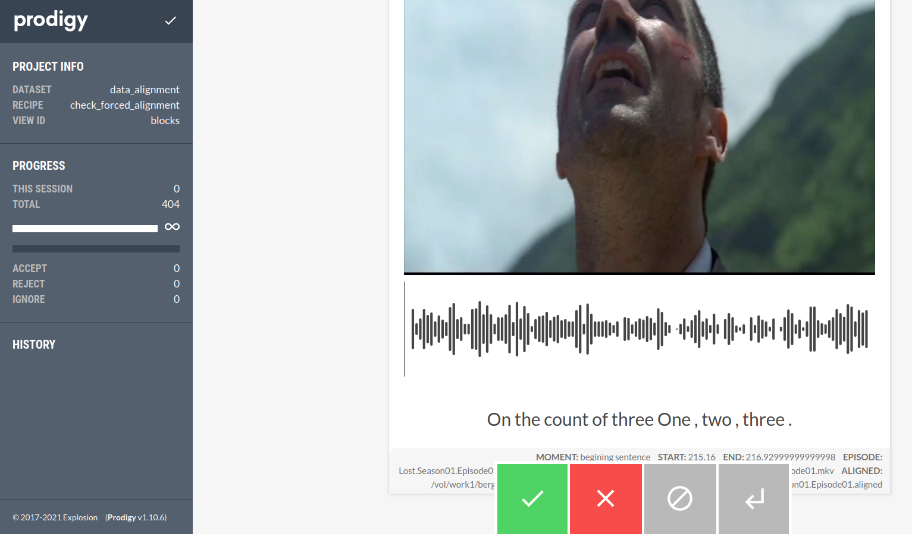
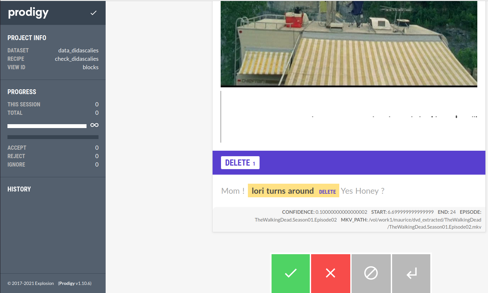
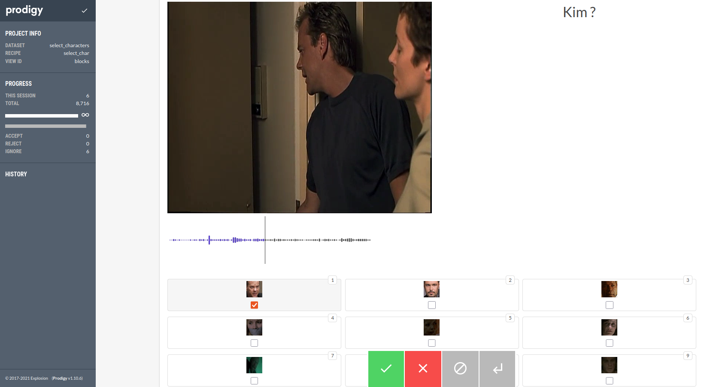
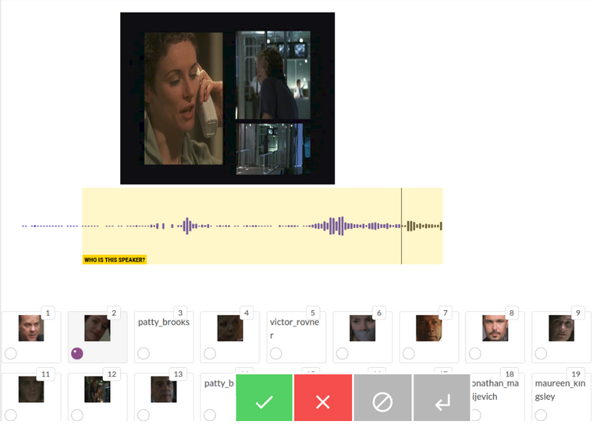
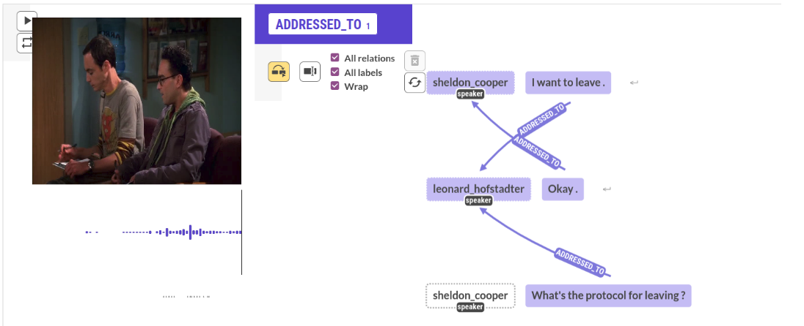
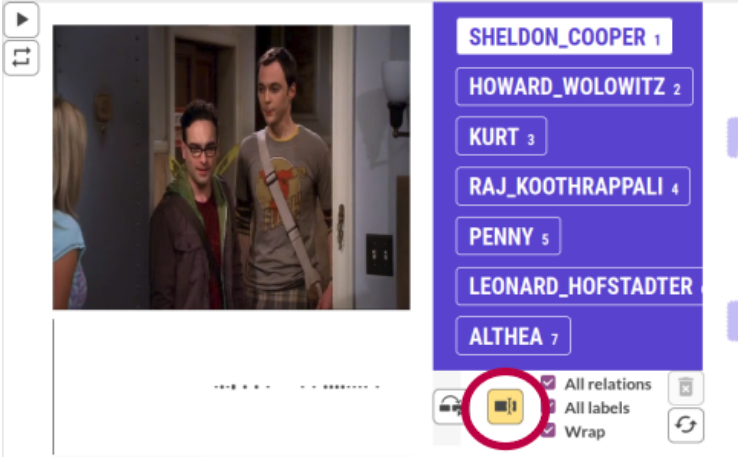

# Annotation guide

## Process

### Before annotation

Make sure that all your alignment files contain lines of length 8, as follow
```bash
<episode_name_field> <speaker_field> <start_time_field> <end_time_field> <word_field> <confidence_field> <entity_linking_field> <addressee_field>

e.g : TheWalkingDead.Season01.Episode02 carl_grimes 8.70 9.06 Mom 0.10 _ _
```
Each line must contain : the episode reference, speaker name, start time of the word, end time of the word, one word, confidence score, entity linking (EL) (represented by “_”, “?”, or “character_name”), addressee (represented by “_”*, “?”*, or “character_name”).

Corresponding script : [adapt_aligned_file.py](https://github.com/julietteBergoend/plumcot-prodigy/blob/main/annotation_scripts/adapt_aligned_file.py)
Usage : PATH TO GUIDE

The script will create a temp file with a copy of the previous transcript, and a new aligned file with one or two “?” sign(s) at the end of each line (depending on the length of the lines). 

* _ : this sign means that the episode was already annotated in EL or Addressee, and that no annotation was done on the current word (because not necessary for example).

* ? : this sign means that the episode was never annotated in EL or Addressees

### Check alignment



Corresponding script : [check_alignment.py](https://github.com/julietteBergoend/plumcot-prodigy/blob/main/plumcot_prodigy/check_alignment.py)

This part allows you to check double episodes in a show. 
The recipe displays the first and the last sentences of each episode in the season you want to annotate. 
If the text corresponds to audio in both examples, the episode is good. If not, it can be because of a double episode. In the last case, you need to check the transcript of the episode.

#### Usage
1. Make sure that you have created a DB before lauching annotation
Create a data base before first usage only.
Recommended name for your database : data_alignment
```bash
(plumcot-prodigy) plumcot-prodigy$ prodigy db-in data_alignment
```
2. Lauch recipe
```bash
(plumcot-prodigy) plumcot-prodigy$ prodigy check_forced_alignment <dataset_name> <show_name> <season> -F plumcot_prodigy/check_alignment.py

e.g : prodigy check_forced_alignment data_alignment Lost Season01 -F plumcot_prodigy/check_alignment.py
```
3. Save your annotations
```bash
(plumcot-prodigy) plumcot-prodigy$ prodigy db-out data_alignment > <path/to/prodigy_databases/data_base_name.jsonl>
```
4. Process your annotations
```bash
(plumcot-prodigy) plumcot-prodigy/annotation_scripts$ ./process_alignment.py <id_series> <data_base_name>

e.g : ./process_alignment.py Lost alignment_data.jsonl
```
### Check didascalies

Corresponding script : [check_didascalies.py](https://github.com/julietteBergoend/plumcot-prodigy/blob/main/plumcot_prodigy/check_didascalies.py)

This recipe allows to delete didascalies in transcription files. 
Prodigy displays all the sentences in the current episode with confidence index under _x_, and allows to select parts of the sentence to delete (if so). Left and right contexts are displayed but with forbidden selection.

#### Usage
1. Create a new database
Recommended name for your database : data_didascalies

2. Lauch the recipe :
```bash
(plumcot-prodigy) plumcot-prodigy$ prodigy check_didascalies.py data_didascalies <show_name> <season> <episode> <confidence_index> -F plumcot_prodigy/check_didascalies.py

e.g : prodigy check_didascalies data_didascalies TheWalkingDead Season01 Episode01 0.3 -F plumcot_prodigy/check_didascalies.py
```
When selection is finished, press _x_ (or _reject_).
If no selection is necessary, press _a_ (or _accept_) or _space_ (or _ignore_).

The top example will display sentences with a confidence index bellow 0.3. 

3. Save your annotations
```bash
e.g : prodigy db-out data_didascalies > seasons1_didascalies.jsonl
```
4. Process your annotations
```bash
(plumcot-prodigy) plumcot-prodigy/annotation_scripts$ ./process_didascalies.py <episode> <data_base_name>

e.g : ./process_didascalies.py TheWalkingDead.Season01.Episode01 seasons1_didascalies.jsonl
```
Didascalies deletion is applied to trancript files (Plumcot/data/{serie_uri}/transcripts/*.txt), not to aligned files.
Once the new trancript file is created, you must lauch [Forced Alignment](https://github.com/PaulLerner/Forced-Alignment) to create a new aligned file. 

### Not_available characters
This part concerns all shows without available characters.
```bash
ER.Season01.Episode01 not_available 6.2 6.5600000000000005 Dr 0.1 ? ?
ER.Season01.Episode01 not_available 6.56 6.56 . 0.95 ? ?
ER.Season01.Episode01 not_available 12.76 13.12 Greene 0.1 ? ?
ER.Season01.Episode01 not_available 13.12 13.12 ? 0.95 ? ?
```
Prodigy displays all the sentences in the current episode with not available speaker, and images corresponding to all the characters of the current episodes.

Two scripts are available for this task, including one recipe with active annotation using speaker diarization model.
#### Before annotation
The two recipes are using image selection. Images have to be size 40x40 to allow correct display.

Corresponding script : [resize_images](https://github.com/julietteBergoend/plumcot-prodigy/blob/main/annotation_scripts/resize_images.py)

Usage:
```bash
(plumcot-prodigy) plumcot-prodigy/annotation_scripts$ ./process_alignment.py <episode_name>

e.g : ./process_alignment.py StarWars.Episode06
```
#### Select_character

Corresponding script : [select_characters.py](https://github.com/julietteBergoend/plumcot-prodigy/blob/main/plumcot_prodigy/select_characters.py)
This recipe is a version without speaker diarization.

1. Process images
2. Enter a new database
3. Lauch recipe
```bash
(plumcot-prodigy) plumcot-prodigy$ prodigy select_char select_characters <episode_name> -F plumcot_prodigy/select_characters.py

e.g : prodigy select_char select_characters 24.Season01.Episode01 -F plumcot_prodigy/select_characters.py
```
When selection is finished, press _a_ (for _accept_) .
If no selection is done, press _space_ (for _ignore_) or _x_.
You can select multiple images when multiple characters are speaking at the same time and uttering the same sentence.

4. Save your annotations
5. Process your annotations
```bash
(plumcot-prodigy) plumcot-prodigy/annotation_scripts$ ./replace_non_available_chars.py <episode> <data_base_name>

e.g : ./replace_non_available_chars.py 24.Season01.Episode01 characters.jsonl
```
Speaker annotations are applied directly to the alignment file.
A temporary file is created with previous alignment.

#### Speakers

Corresponding script : [speaker.py](https://github.com/julietteBergoend/plumcot-prodigy/blob/main/plumcot_prodigy/speaker.py)

Active learning annotation with speaker recognition model.

1. Before annotation : format the data to annotate
  - create speech turn file :	this file gathers all speech turns without speaker in the alignment file.
```bash
(plumcot-prodigy) plumcot-prodigy/annotation_scripts$ ./create_speech_turns.py <episode_name>
```
  - create speakers file : this file is a list of all the speakers of the current show.
```bash
(plumcot-prodigy) plumcot-prodigy/annotation_scripts$ ./create_speakers_txt.py <id_series>
```
2. Create a new database
3. Lauch recipe
```bash
(plumcot-prodigy) plumcot-prodigy$ prodigy pyannote.speaker <path/to/speechturns.jsonl> 
-speakers=<path/to/speakers.txt> -allow-new-speaker -F plumcot_prodigy/speaker.py

e.g : prodigy pyannote.speaker speakers_data speech_turns.jsonl -speakers=speakers.txt -allow-new-speaker -F plumcot_prodigy/speaker.py
```
The recipe uses the same principle as select characters : select corresponding locutor thanks to images.
Multiple selections are _not allowed_.

This recipe stores annotations to make predictions on the current speaker.
Predictions start after about 20 annotations. 

4. Save your annotations
5. Process your annotations
```bash
(plumcot-prodigy) plumcot-prodigy/annotation_scripts$ ./replace_non_available_chars.py <episode> <data_base_name>

e.g : ./replace_non_available_chars.py 24.Season01.Episode01 speakers_data.jsonl
```
Speaker annotations are applied directly to the alignment file.
A temporary file is created with previous alignment.

### Addressees

Selecting relations (above)

Labelling relations (above)

Corresponding script : [addressees.py](https://github.com/julietteBergoend/plumcot-prodigy/blob/main/plumcot_prodigy/adressee.py)

This recipe allows you to annotate addressees for 5 speech turns per example.
Addressee annotation consists in making relations between sentences and speakers. 

#### Usage
1. Create a database

2. Lauch recipe
```bash
(plumcot-prodigy) plumcot-prodigy$ prodigy addressee addressee_data <episode_name> -F plumcot_prodigy/adressee.py
```
The head of the relation is always a speaker whereas the child of the relation is always a sentence (see first illustration).

Sometimes relations can’t be annotated because one speaker is talking during 5 speech turns. In this case, a labelling interface is available to label the sentence with its addressee (see second illustration).
Labelling can also be used when the addressee is addressed to multiple speakers which are not in the 5 speech turns.
Combination of labelling and selection is allowed.

Press _a_ when addressee annotation is done for the current example.
Press _space_ when no annotations are done/needed.

3. Save your annotations

4. Process your annotations
```bash
(plumcot-prodigy) plumcot-prodigy/annotation_scripts$ ./process_addressee.py <episode> <data_base_name>
```


### Entity linking

#### Entity linking - 1st, 2nd persons & names

#### Entity linking - 3rd person & names

## Notes

### video.py

### custom_loaders.py

### forced_alignment.py
